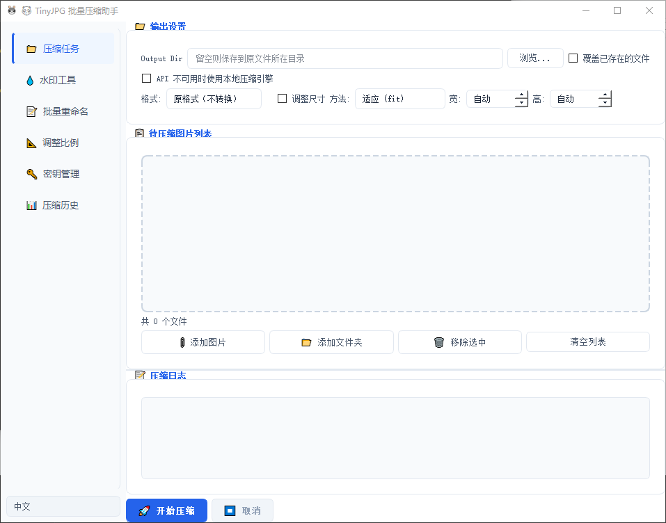
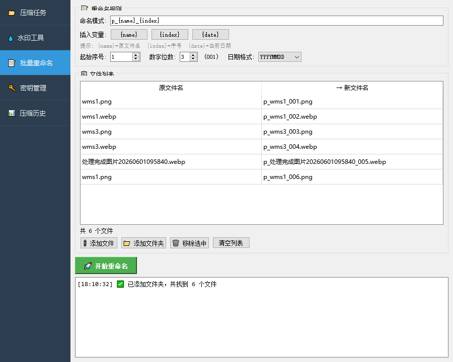

# TinyJPG 批量压缩助手 / TinyOpt Batch Image Compressor

> 🌐 [seojeck.com](https://seojeck.com) — 官方网站 / Official Website

<input type="radio" id="tab-en" name="tab-lang" checked>
<input type="radio" id="tab-zh" name="tab-lang">

  <label for="tab-en">English</label>
  <label for="tab-zh">中文</label>

TinyOpt is a **free, open-source Windows desktop tool** for batch image optimization powered by the TinyPNG API. It integrates **compression, watermarking, format conversion, and batch renaming** into one efficient workflow.

## Features

### Image Compression
- Input formats: JPG, PNG, WebP, AVIF, BMP, GIF, TIFF
- Output formats: JPEG, PNG, WebP, GIF, TIFF, BMP, AVIF, ICO, PDF (9 formats)
- Resize modes: fit, scale, crop, thumbnail
- Auto key rotation across multiple API keys with up to 3 concurrent threads
- Real-time usage monitoring, auto-disable exhausted keys

### Watermark Tool
- Image watermark, text watermark, or combined image+text
- Drag-and-drop WYSIWYG positioning
- Adjustable opacity, scale, and margins
- Custom fonts and colors

### Batch Rename
- Template variables: `{name}`, `{index}`, `{date}`
- Live preview of rename results
- Configurable start index, zero-padding, date format

## Quick Start

1. Download the latest `.exe` from [Releases](https://github.com/SinMu-L/TinyOpt/releases) and run it directly (no installation required)
2. Add your TinyPNG API Key in "Key Management" (free signup: https://tinypng.com/developers)
3. Switch to "Compression" tab, add images, set output directory and parameters, click "Start"
4. Use Watermark and Rename tools in their respective tabs

> 500 free compressions per month per API key. Multiple keys stack.

## Download

Pre-built executables are available in the `dist/` directory — download and double-click to run.

一款 Windows 桌面工具，集**图片批量压缩**、**水印添加**、**格式转换**、**批量重命名**于一体，基于 TinyPNG API 实现高效的图片无损压缩。

## 功能

### 图片压缩
- 支持 JPG、PNG、WebP、AVIF、BMP、GIF、TIFF 等格式输入
- 可输出为 JPEG、PNG、WebP、GIF、TIFF、BMP、AVIF、ICO、PDF 共 9 种格式
- 支持缩放（适配、比例缩放、裁剪、缩略图）
- 多 API Key 自动轮转，最高 3 线程并行压缩
- 实时用量监控，自动禁用额度耗尽的 Key

### 水印工具
- 支持图片水印、文字水印、图文混合水印
- 可视化拖拽定位水印位置
- 可调节透明度、缩放比例、边距
- 自由选择字体与颜色

### 批量重命名
- 支持模板变量：`{name}`、`{index}`、`{date}`
- 实时预览重命名结果
- 可设起始序号、位数补零、日期格式

## 快速使用

1. 从 [Releases](https://github.com/SinMu-L/TinyOpt/releases) 下载最新版 exe，直接运行（无需安装）
2. 在「密钥管理」中添加你的 TinyPNG API Key（免费申请：https://tinypng.com/developers）
3. 切换到「压缩任务」添加图片，设置输出目录和参数，点击「开始压缩」
4. 水印工具和批量重命名分别在对应标签页操作

> 每月 500 张免费额度，多 Key 可叠加。

## 下载

预编译的 exe 文件在 `dist/` 目录中，下载后双击即可运行。

## 更新日志 / Changelog

- **v1.7.3** — 修复构建后 exe 无法切换中英文的问题，i18n 翻译文件现已正确打包 / Fixed i18n translation files not bundled in PyInstaller build
- **v1.3.0** — 新增 AVIF/ICO/PDF 输出格式，优化压缩队列管理 / Added AVIF/ICO/PDF support, improved queue management
- **v1.2.0** — 新增批量重命名功能 / Added batch rename feature
- **v1.1.0** — 新增水印工具，支持可视化拖拽定位 / Added watermark tool with drag-and-drop positioning
- **v1.0.0** — 基础压缩功能上线 / Initial compression release

